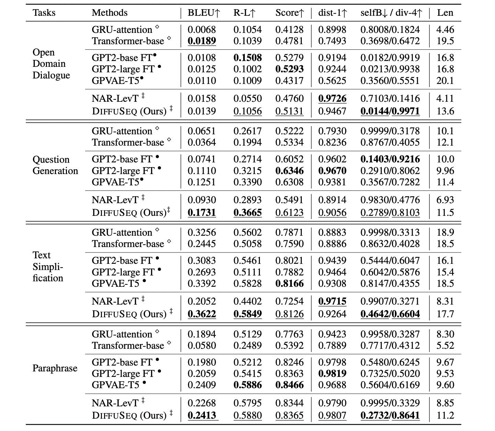

#  DiffuSeq

<p align="center"></p>
<table align="center">
    <thead>
        <tr>
            <th align="center">TITLE</th>
            <th align="center">AUTHOR</th>
            <th align="center">DATE</th>
            <th align="center">CATEGORY</th>
        </tr>
    </thead>
    <tbody>
        <tr>
            <td align="center">Sequence To Sequence Text Generation With Diffusion Models</td>
            <td align="center">Shubham Talbar</td>
            <td align="center">2022-10-28</td>
            <td align="center">NLP</td>
        </tr>
    </tbody>
</table>
<p></p>
  
<p align = "left">
The following blog is an attempt to simplify and understand the use of Diffusion Models in complex conditional language generation tasks. This article is based on the paper <strong>DIFFUSEQ: Sequence To Sequence Text Generation With Diffusion Models</strong>
</p>
  
<!-- more -->

Paper: <https://arxiv.org/pdf/2210.08933.pdf>

GitHub Repo: <https://github.com/Shark-NLP/DiffuSeq>

Official Codebase for [*__*DiffuSeq*__: Sequence to Sequence Text Generation With Diffusion Models*](https://arxiv.org/abs/2210.08933).

&nbsp;

## What problem does the paper solve?

Diffusion Models have recently emerged as a new paradigm for generative models. These models have had success in domains using continuous signals such as vision and audio. But adapting diffusion models to natural language is difficult due to the discrete non-continuous nature of text. This paper tries to tackle this task by proposing **DiffuSeq** which is a diffusion model designed for sequence-to-sequence text generation tasks. The authors evaluate the performance of **DiffuSeq** over a wide variety of SeqToSeq tasks and reported that it infact performed better than those and a state-of-the-art model based on pre-trained language models.

&nbsp;

## What are diffusion models?

In machine learning, diffusion models, also known as diffusion probabilistic models, are a class of latent variable models. Diffusion models were introduced in 2015 with a motivation from non-equilibrium thermodynamics. These models are Markov chains trained using variational inference. The goal of diffusion models is to learn the latent structure of a dataset by modeling the way in which data points diffuse through the latent space. In computer vision, this means that a neural network is trained to denoise images blurred with Gaussian noise by learning to reverse the diffusion process. Existing generative models such as Generative Adversarial Networks (Goodfellow et al., 2014), Variational Auto Encoders (Kingma & Welling, 2014) and Flow-based models (Dinh et al., 2017) have shown great success in generating high-quality samples, but each has some limitation of its own. GAN models are known for potentially unstable training and less diversity in generation due to their adversarial training nature. VAE relies on a surrogate loss. Flow models have to use specialized architectures to construct reversible transform.   

Diffusion models are inspired by non-equilibrium thermodynamics. They define a markov chain of diffusion steps to slowly add random noise to data and then learn to reverse the diffusion process to construct desired data samples from the noise. Unlike VAE or flow models, diffusion models are learned with a fixed procedure and the latent variable has high dimensionality (same as original data). 

Diffusion models can be applied to a variety of tasks, including image denoising, inpainting, super-resolution, and image generation. For example, an image generation model would start with a random noise image and then, after having been trained reversing the diffusion process on natural images, the model would be able to generate new natural images. Announced on 13 April 2022, OpenAI's text-to-image model DALL-E 2 is a recent example. It uses diffusion models for both the model's prior (which produces an image embedding given a text caption) and the decoder that generates the final image.

&nbsp;

<p align = "center">

</p>

<p align = "center">
<strong>Overview of different types of generative models</strong>
</p>

&nbsp;

The key concept in Diffusion Modelling is that if we could build a learning model which can learn the systematic decay of information due to noise, then it should be possible to reverse the process and therefore, recover the information back from the noise. This concept is similar to VAEs in the way that it tries to optimize an objective function by first projecting the data onto the latent space and then recovering it back to the initial state. However, instead of learning the data distribution, the system aims to model a series of noise distributions in a Markov Chain and “decodes” the data by undoing/denoising the data in a hierarchical fashion.

&nbsp;

## Denoising Diffusion Models

The idea of denoising diffusion model has been around for a long time. It has its roots in Diffusion Maps concept which is one of the dimensionality reduction techniques used in Machine Learning literature. It also borrows concepts from the probabilistic methods such as Markov Chains which has been used in many applications. The original Denoising Diffusion method was proposed in Sohl-Dickstein et al. A denoising diffusion modeling is a two step process: the forward diffusion process and the reverse process or the reconstruction. In the forward diffusion process, gaussian noise is introduced successively until the data becomes all noise. The reverse reconstruction process undoes the noise by learning the conditional probability densities using a neural network model. An example depiction of such a process can be visualized below.


&nbsp;

<p align = "center">

</p>

<p align = "center">
<strong>Process of Denoising Diffusion Probabilistic Model</strong>
</p>

&nbsp;

## Why and What is DiffuSeq?

DiffuSeq is an extended vanilla diffusion model to learn conditional text generation, concerning the model architecture and the training objective. 

SEQ2SEQ is an essential setting in NLP that covers a wide range of important tasks such as open-ended sentence generation, dialogue, paraphrasing, and text style transfer. This paper proposes **DiffuSeq**, a classifier-free **diffusion model** that supports SEQ2SEQ text generation tasks. By modeling the conditional probability of the target sentence **w** given context **x** using one single model, one advantage of DIFFUSEQ is that this paradigm allows a complete model to fit data distribution and utilize conditional guidance, rather than depending on a separate classifier.

To establish the effectiveness of **DiffuSeq**, the authors conduct experiments on four SEQ2SEQ tasks. Compared to autoregressive (AR) and non-autoregressive (NAR) models, which suffer from the “degeneration” problem (Holtzman et al., 2019) and rely on decoding strategies, DIFFUSEQ can achieve considerable sentence-level diversity without sacrificing the quality.

&nbsp;

<p align = "center">

</p>

<p align = "center">
<strong>The diffusion process of our conditional diffusion language model DiffuSeq</strong>
</p>

&nbsp;

## Experiments

The authors conduct experiments to validate the effectiveness of DIFFUSEQ on four different tasks, against six strong AR/NAR baselines. 

**Tasks and Datasets.** SEQ2SEQ generation covers a wide range of tasks, among which four typical and popular tasks were chosen, listed as follows. **Open domain dialogue** requires models to generate informative responses given a dialogue context. The authors used Commonsense Conversation Dataset (Zhou
et al., 2018), which is extracted from Reddit single-round dialogs, with over 3 million conversational pairs. **Question generation(QG)** aims to generate questions given a context as input. To obtain sufficient training samples, the authors used the dataset Quasar-T (Dhingra et al., 2017) preprocessed by Lin et al. (2018), and then generate document-question pairs to obtain 119K training samples in the end. **Text simplification** aims to revise the complex text into sequences with simplified grammar and word choice. Jiang et al. (2020) constructs a corpus consisting of 666K complex-simple sentences with revision alignment. Paraphrase task generates an alternative surface form in the same language expressing the same semantic content. We adopt widely used Quora Question Pairs3 (QQP) sourced from the community question answering forum Quora, with 147K positive pairs.

**Baselines.** The authors considered three groups of models as baselines, covering both AR and NAR architectures. The first group of methods adopts encoder-decoder architecture (Cho et al., 2014) which is well-studied for SEQ2SEQ tasks, and we conduct experiments on two popular models: GRU with attention and Transformer (Vaswani et al., 2017). The second group is the finetuned large pre-trained language model (PLM), among which GPT2 (Radford et al., 2019) has demonstrated great success in almost all SEQ2SEQ tasks. We further compare to GPVAE (Du et al., 2022), which augments a pre-trained T5 (Raffel et al., 2020) with VAE to improve the generation diversity. For the last group of baselines, we consider LevT (Gu et al., 2019), a widely used, strong iterative NAR model.

**Evaluation.** The authors evaluate the generated sequences from two aspects: quality and diversity. To evaluate the quality, they used the standard metric BLEU (Papineni et al., 2002) and ROUGE (Lin, 2004) score. Since string-similarity-based metrics can be unsatisfactory for open-ended generation, they also report BERTScore (Zhang et al., 2019) that assesses the semantic similarity between generated sentences and references. Higher scores of BLEU, ROUGE and BERTScore reflect better performance. As for diversity, they used distinct unigram (dist-1) to measure intra-diversity within each generated sentence, where the lower dist-1 indicates that the generated sentence contains more repeated words. For sentence-level diversity evaluation, they consider sentence-level self-BLEU (Zhu et al., 2018) to measure the n-gram overlap between the set of outputs w.r.t one source sentence, and we additionally use diverse 4-gram (div-4) (Deshpande et al., 2019) to measure the ratio of distinct 4-grams in the set of outputs per source sentence. The lower self-BLEU and higher div-4 suggest higher diversity of generation. For each method including DIFFUSEQ, they generate 3 samples for each source sentence to compute the diversity metrics.

&nbsp;

<p align = "center">

</p>

<p align = "center">
<strong>The overall results of different methods on different SEQ2SEQ tasks. The first group of methods adopt autoregressive encoder-decoder architecture and the second group is the finetuned large pre-trained language model (also in autoregressive manner) while the last group is non-autoregressive. The best results are bold, and the best results without PLMs are underlined.</strong>
</p>

&nbsp;


## Significant Contributions

- The proposed __*DiffuSeq*__ as a conditional language model is trained end-to-end in a classifier-free manner.
- The authors have established a theoretical connection among AR, NAR and __*DiffuSeq*__ models (refer to the original paper).
- __*DiffuSeq*__ is a powerful model for text generation, matching or even surpassing competitive AR, iterative NAR, and large-PLMs on quality and diversity.

The study addresses promising achievements by such a new sequence-to-sequence learning paradigm.

<p align = "center">

</p>
<p align = "center">

</p>

&nbsp;

## Conclusion
Important questions addressed in this blog:

1. What problem does the paper solve specifically?
2. What are diffusion models?
3. What are forward and reverse process in Diffusion Models?
4. Why and how is DiffuSeq effective?

DIFFUSEQ tackles SEQ2SEQ tasks in a diffusion way, which contains the strong potential to achieve better generation quality and diversity trade-off. In other words, DIFFUSEQ is capable of producing highly diverse sentences without sacrificing much of the quality. The capability enables favorable characteristics of DIFFUSEQ to further enhance the quality of final results, by leveraging a minimum Bayes risk decoding algorithm. Besides, the author prove theoretically that DiffuSeq model is a powerful extension of iterativeNAR model. The empirical results demonstrate that DIFFUSEQ is also a powerful model for text generation, matching or even surpassing competitive autoregressive, iterative non-autoregressive, and large-scale pre-trained models on quality and diversity. Given the limited progress of current diffusion models on text generation, our study addresses promising achievements by such a new sequence-to-sequence learning paradigm.
                                             
&nbsp;
                                             
## Reference 
                                             
```
@article{gong2022diffuseq,
  title={DiffuSeq: Sequence to Sequence Text Generation with Diffusion Models},
  author={Gong, Shansan and Li, Mukai and Feng, Jiangtao and Wu, Zhiyong and Kong, Lingpeng},
  journal={arXiv preprint arXiv:2210.08933},
  year={2022}
}
```

```
@article{diffusionrafideasy,
    title   = "Diffusion Models Made Easy",
    author  = "J. Rafid Siddiqui",
    journal = "[lilianweng.github.io](https://azad-wolf.medium.com/)",
    year    = "2022",
    month   = "May",
    url     = "https://towardsdatascience.com/diffusion-models-made-easy-8414298ce4da"
}                                            
```                                          

```
@article{weng2021diffusion,
    title   = "What are diffusion models?",
    author  = "Weng, Lilian",
    journal = "lilianweng.github.io",
    year    = "2021",
    month   = "Jul",
    url     = "https://lilianweng.github.io/posts/2021-07-11-diffusion-models/"
}                                            
```

```
https://en.wikipedia.org/wiki/Diffusion_model
```

```
https://theaisummer.com/diffusion-models/#diffusion-process
```                                                                            
                                                                               
                                             
                                             
                                             
